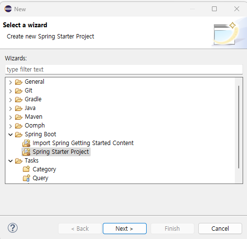
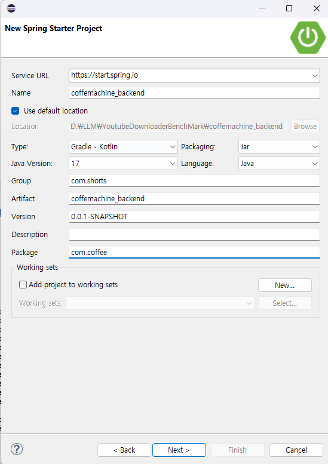
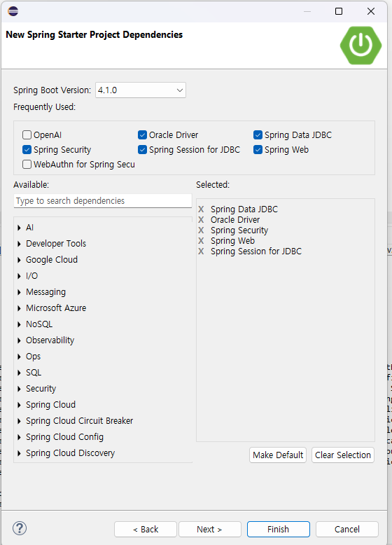

[문제상황]









이 과정 대로 진행한다면 스프링 부트를 시작하게되면, 다음 문제가 발생한다. 
```
Failed to configure a DataSource: 'url' attribute is not specified and no embedded datasource could be configured.

Reason: Failed to determine a suitable driver class


Action:

Consider the following:
	If you want an embedded database (H2, HSQL or Derby), please put it on the classpath.
	If you have database settings to be loaded from a particular profile you may need to activate it (no profiles are currently active).
```

이게 핵심인데

각자에게 맞는 DB를 설정해야 한다. 


[해결책]

아래의 코드를 application.properties에 설치하면된다. 
다음 값들은  각자 DB에 맞게 값을 수정하면된다. 
아래의 값은 Oracle을 기반으로 한 예시임.


```
spring.datasource.url=jdbc:oracle:thin:@localhost:1521/FREEPDB1
spring.datasource.username=SHORTS_DB
spring.datasource.password=shorts1234
spring.datasource.driver-class-name=oracle.jdbc.OracleDriver
```